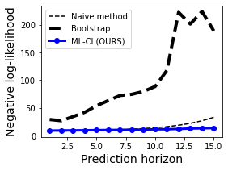

# ml-ci

Interval forecasting for covid19 cases.
Repo in construction...🏗🏗🏗

---
> Main contributor:  <a href="https://github.com/ablacan" target="_blank" style="text-decoration:none; color: #F08080">Alice Lacan</a>  
> Email: <a href="mailto:alice.b.lacan@gmail.com" style="text-decoration:none; color: #F08080">alice.b.lacan@gmail.com</a>
---

The Covid-19 interval forecasting method developed here leads to a minimization of the negative log-likelihood error up to 15 days ahead.

## 1. Fit model on real country data
In our work, we focused on the 54 following countries: 'United Kingdom', 'United States','Australia', 'Austria', 'Belgium', 'Bulgaria', 'Canada', 'China', 'Denmark', 'Finland', 'France', 'Germany', 'Greece', 'India', 'Israel', 'Italy', 'Japan', 'Luxembourg', 'Netherlands', 'Norway', 'Poland', 'Portugal', 'Russia', 'South Africa', 'Korea, Republic of', 'Spain', 'Sweden', 'Taiwan', 'Chile', 'Colombia', 'China', 'Egypt', 'Congo', 'Guana', 'Iran', 'Libya', 'Kenya', 'Mexico', 'New Zealand', 'Qatar', 'Peru', 'Sudan', 'Turkey', 'Bangladesh', 'Somalia', 'Singapore', 'Senegal','Ukraine', 'Vietnam', 'Yemen', 'Oman', 'Uruguay', 'Venezuela', 'United Arab Emirates', 'Pakistan'.

To fit our SIR model and stringency parameter on these countries, run the following script:

`python /python_scripts/countries_forecast.py`

This script will save all results a dictionary in './results_stringency/SIR/result_{COUNTRY}_{TRAIN_WINDOW}days.npy' for each country. The default training window is 100 days (`TRAIN_WINDOW`=100).

## 2. Generate simulations

`python /python_scripts/run_simulations.py -nb_simulations <NUMBER OF SIMULATIONS>`

This script will generate random population numbers (in Millions), stringency data (governmental interventions scenarios) then apply random transofrmations to obtain beta series (transmission rates) and pass them through a SIR model dynamics (no fitting here), to eventually obtain simulated covid19 cases. Both covid19 scenarios and corresponding betas, stringency are stored as a dictionary in '/results_predictor/SIR/simulations_{NUMBER OF SIMULATIONS}samples.npy'.

To load these simulations, run the following with desired key ('simulations' for stringency data, 'betas' for beta series and 'cases' for simulated covid19 cases):
`simulations_dict = np.load('/results_predictor/SIR/simulations_{NUMBER OF SIMULATIONS}samples.npy', allow_pickle=True).item()`
`simulations_{KEY} = simulations_dict[KEY]`
